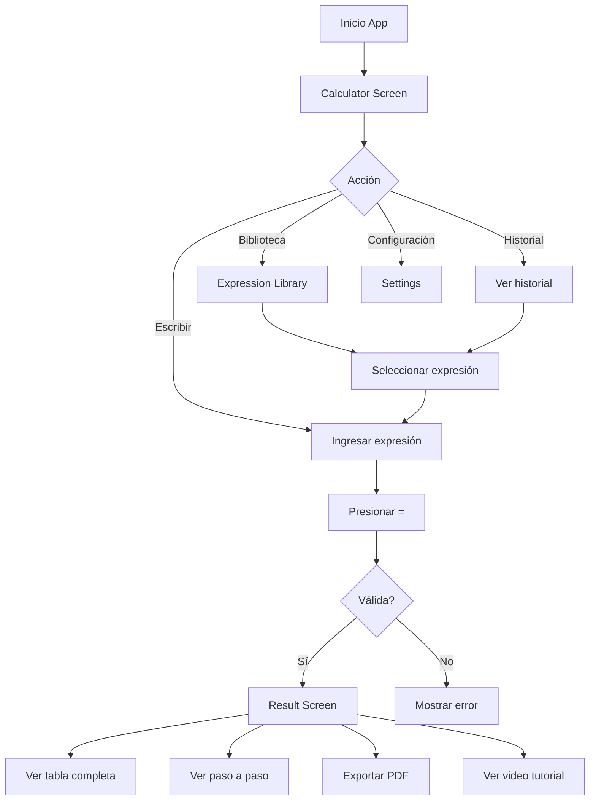

# Contexto de la Aplicación - Tablas de Verdad 2025

## 📱 Descripción General

**Tablas de Verdad** es una aplicación Flutter para Android que permite calcular y visualizar tablas de verdad de expresiones lógicas. La app es educativa y está dirigida a estudiantes de lógica matemática, informática y áreas relacionadas.

### Información Básica

- **Nombre**: Tablas de Verdad / Truth Tables
- **Versión**: 4.0.8 (Build 40008)
- **Plataformas**: Android (con capacidad para iOS, web, desktop)
- **Idiomas**: Español e Inglés
- **Framework**: Flutter 3.7.0+

---

## 🎯 Funcionalidad Principal

### 1. **Calculadora de Tablas de Verdad**

La funcionalidad core de la app permite:

- Ingresar expresiones lógicas usando variables (A-Z, a-z, 0, 1)
- Calcular automáticamente la tabla de verdad completa
- Determinar si la expresión es:
  - **Tautología**: Siempre verdadera (✅)
  - **Contradicción**: Siempre falsa (❌)
  - **Contingencia**: Depende de los valores (⚠️)
- Mostrar paso a paso la resolución
- Visualizar la tabla final con todas las combinaciones

### 2. **Operadores Lógicos Soportados**

La aplicación soporta los siguientes operadores:

| Operador                   | Símbolos | Descripción         |
| -------------------------- | -------- | ------------------- |
| Negación                   | ~, ¬, !  | NOT                 |
| Conjunción                 | ∧, &     | AND                 |
| Disyunción                 | ∨, \|    | OR                  |
| Condicional                | ⇒        | Implicación         |
| Bicondicional              | ⇔        | Equivalencia        |
| Anticondicional            | ￩        | Implicación inversa |
| XOR                        | ⊻, ⊕     | OR Exclusivo        |
| NAND                       | ⊼        | NOT AND             |
| NOR                        | ↓        | NOT OR              |
| Negación del condicional   | ⇏        | NOT Implicación     |
| Negación del bicondicional | ⇎        | NOT Equivalencia    |

### 3. **Algoritmo de Resolución**

#### Proceso de Cálculo:

1. **Formateo de entrada**: Normaliza paréntesis y caracteres
2. **Conversión Infijo a Postfijo**: Usa el algoritmo Shunting Yard
3. **Validación sintáctica**: Verifica que la expresión esté bien formada
4. **Extracción de variables**: Identifica todas las variables únicas
5. **Generación de combinaciones**: Crea todas las combinaciones binarias posibles (2^n)
6. **Evaluación por pasos**: Calcula cada subexpresión según precedencia
7. **Generación de tabla final**: Construye la tabla con todas las columnas
8. **Clasificación**: Determina si es tautología, contradicción o contingencia

#### Precedencia de Operadores:

```
~ (Negación) > ⊼ (NAND) > ⊻ (XOR) > ⊕ (XOR2) > ↓ (NOR) >
∧ (AND) > ∨ (OR) > ⇍ > ￩ > ⇏ > ⇎ > ... > ⇒ (Condicional) > ⇔ (Bicondicional)
```

---

## 🏗️ Arquitectura de la Aplicación

### Estructura de Directorios

```
lib/
├── main.dart                 # Punto de entrada, configuración de la app
├── api/                      # Comunicación con backend
│   └── api.dart             # Endpoints para expresiones y tutoriales
├── class/                    # Clases de dominio
│   ├── truth_table.dart     # Lógica principal de cálculo
│   ├── operator.dart        # Definición de operadores lógicos
│   ├── row_table.dart       # Fila de tabla de verdad
│   └── step_proccess.dart   # Paso de resolución
├── const/                    # Constantes
│   ├── const.dart           # IDs de AdMob, configuraciones
│   ├── colors.dart          # Temas y colores
│   ├── routes.dart          # Rutas de navegación
│   ├── calculator.dart      # Configuración del teclado
│   └── translations.dart    # Traducciones legacy
├── db/                       # Base de datos local
│   └── database.dart        # SQLite para historial
├── dialogs/                  # Diálogos
│   └── history_dialog.dart  # Historial de cálculos
├── l10n/                     # Internacionalización
│   ├── app_localizations.dart
│   ├── app_en.arb
│   └── app_es.arb
├── model/                    # Modelos de datos
│   ├── settings_model.dart  # Configuraciones globales
│   ├── ads.dart             # Modelo de anuncios
│   ├── list_response.dart   # Respuesta de API (lista)
│   └── post_expression_response.dart
├── screens/                  # Pantallas de la app
│   ├── calculator_screen.dart          # Pantalla principal
│   ├── truth_table_result_screen.dart  # Resultados
│   ├── expression_library_screen.dart  # Biblioteca de ejemplos
│   ├── settings_screen.dart            # Configuraciones
│   ├── video_screen.dart               # Reproductor de YouTube
│   ├── privacy_policy_screen.dart      # Política de privacidad
│   ├── truth_table_pdf_viewer.dart     # Visor de PDF
│   └── ad_mob_service.dart             # Servicio de anuncios
├── service/                  # Servicios
│   └── purchase_service.dart # Compras in-app (versión Pro)
├── sheets/                   # Bottom sheets
│   └── settings_bottom_sheet.dart
├── utils/                    # Utilidades
│   ├── generate_pdf.dart    # Generación de PDFs
│   ├── go_to_solution.dart  # Navegación a resultados
│   ├── show_pro_version_dialog.dart
│   ├── open_support_chat.dart
│   ├── show_snackbar.dart
│   ├── get_cell_value.dart  # Formateo de celdas (V/F o 1/0)
│   ├── utils.dart           # Utilidades generales
│   └── ads.dart             # Gestión de anuncios
└── widget/                   # Widgets reutilizables
    ├── keypad.dart          # Teclado de operadores
    ├── drawer.dart          # Menú lateral
    ├── expression_card.dart # Card de expresión
    ├── banner_ad_widget.dart
    ├── benefit_item.dart
    └── pro_icon.dart
```

### Patrón de Arquitectura

- **State Management**: Provider
- **Base de datos**: SQLite (sqflite)
- **Navegación**: Named routes
- **Internacionalización**: ARB files + flutter_localizations

---

## 📊 Modelos de Datos Principales

### 1. TruthTable (class/truth_table.dart)

```dart
class TruthTable {
  String infix;              // Expresión en notación infija
  String postfix;            // Expresión en notación postfija
  List<String> variables;    // Variables únicas (A, B, C...)
  List<RowTable> table;      // Filas de la tabla
  List<StepProcess> steps;   // Pasos de resolución
  TruthTableType tipo;       // tautology | contradiction | contingency
  List<List<String>> finalTable; // Tabla completa generada
  int totalRows;             // 2^n combinaciones
  // ... algoritmos de cálculo
}
```

### 2. Settings (model/settings_model.dart)

```dart
class Settings extends ChangeNotifier {
  Locale locale;             // es | en
  ThemeMode themeMode;       // light | dark | system
  TruthFormat truthFormat;   // V/F o 1/0
  MintermOrder mintermOrder; // asc | desc
  KeypadMode keypadMode;     // advanced | simple
  bool isProVersion;         // Pro status
  // ... métodos de persistencia
}
```

### 3. Expression (model/list_response.dart)

```dart
class Expression {
  int id;
  String expression;
  String type;              // TAUTOLOGY | CONTRADICTION | CONTINGENCY
  String? videoUrl;         // URL de YouTube para tutoriales
  // ...
}
```

---

## 🖥️ Pantallas Principales

### 1. **Calculator Screen** (Pantalla Principal)

- **Ruta**: `/` (Routes.calculator)
- **Componentes**:
  - TextField para expresión lógica
  - Teclado personalizado (Keypad) con operadores
  - Botón de evaluar (=)
  - Drawer con menú lateral
  - Banner de anuncios (si no es Pro)
- **Acciones**:
  - Escribir expresión
  - Limpiar (AC)
  - Borrar último carácter (⌫)
  - Cambiar entre mayúsculas/minúsculas (Aa)
  - Evaluar expresión (=)
  - Ver historial

### 2. **Truth Table Result Screen** (Resultados)

- **Ruta**: Navegación directa
- **Componentes**:
  - Banner de resultado (Tautología/Contradicción/Contingencia)
  - Tabs: "Evaluación" y "Tabla final"
  - Pasos expandibles (ExpansionTile) con subtablas
  - Tabla final completa
  - FloatingActionButton para video tutorial (si disponible)
- **Acciones**:
  - Ver paso a paso
  - Expandir/colapsar pasos
  - Ver tabla completa
  - Exportar a PDF
  - Ver video tutorial (si existe)

### 3. **Expression Library Screen** (Biblioteca)

- **Ruta**: `/library` (Routes.library)
- **Componentes**:
  - Lista infinita de expresiones de ejemplo
  - Filtros por tipo (Tautología, Contradicción, Contingencia)
  - Toggle "Solo tutoriales con video"
  - Cards de expresiones con descripción
- **Acciones**:
  - Scroll infinito (paginación)
  - Filtrar por tipo
  - Seleccionar expresión para calcular
  - Ver video tutorial asociado

### 4. **Settings Screen** (Configuraciones)

- **Ruta**: `/settings` (Routes.settings)
- **Opciones**:
  - Idioma (Español/Inglés)
  - Tema (Claro/Oscuro/Sistema)
  - Valores de verdad (V/F o 1/0)
  - Orden de minterms (Ascendente/Descendente)
  - Modo de teclado (Avanzado/Simple)
  - Política de privacidad
  - Actualizar a Pro

### 5. **Video Screen** (Reproductor)

- Reproduce videos de YouTube integrados
- Usa youtube_player_flutter
- Videos educativos explicando expresiones específicas

---

## 🔌 Integraciones y Dependencias

### Dependencias Principales

```yaml
# State Management
provider: ^6.1.4

# UI/UX
google_mobile_ads: ^6.0.0 # Monetización
font_awesome_flutter: ^10.8.0 # Iconos
flutter_native_splash: ^2.4.6 # Splash screen

# Funcionalidad
sqflite: ^2.4.2 # Base de datos local
shared_preferences: ^2.5.3 # Configuraciones
pdf: ^3.11.3 # Generación de PDFs
easy_pdf_viewer: ^1.0.8 # Visor de PDFs
youtube_player_flutter: ^9.1.1 # Reproductor de YouTube
webview_flutter: ^4.11.0 # WebView

# Compartir y archivos
share_plus: ^11.0.0 # Compartir contenido
open_file: ^3.5.10 # Abrir archivos
path_provider: ^2.1.5 # Rutas del sistema

# Monetización
in_app_purchase: ^3.2.1 # Compras in-app (versión Pro)

# Comunicación
url_launcher: ^6.3.1 # Abrir URLs
whatsapp_unilink: ^2.1.0 # Enlaces de WhatsApp

# Internacionalización
intl: ^0.20.2
flutter_localizations: sdk
```

### Backend API

- **URL**: `https://jovannyrch-1dfc553c9cbb.herokuapp.com/api`
- **Endpoints**:
  - `POST /expressions`: Registra expresión calculada
  - `GET /expressions`: Obtiene lista de expresiones con paginación
    - Query params: `page`, `type`, `videos`
  - Responde con links a videos de YouTube para tutoriales

---

## 💰 Modelo de Monetización

### Versión Gratuita

- Anuncios intersticiales (cada N operaciones)
- Anuncios banner
- Funcionalidad completa de cálculo
- Historial local

### Versión Pro (`isProVersion = true`)

- Sin anuncios
- Soporte premium
- Acceso prioritario a nuevas funcionalidades
- **Activación**: In-app purchase (`pro_version`)
- **Precio**: Configurado en Play Store

### IDs de AdMob

```dart
// Versión Español
ADMOB_ID: ca-app-pub-4665787383933447~4689744776
VIDEO_ID: ca-app-pub-4665787383933447/1003394249
STEP_BY_STEP: ca-app-pub-4665787383933447/9789289099
SHARE_AND_SAVE_ID: ca-app-pub-4665787383933447/8643480964
BANNER_1: ca-app-pub-4665787383933447/9637438366

// Versión Inglés
ADMOB_ID: ca-app-pub-4665787383933447~1652617896
VIDEO_ID: ca-app-pub-4665787383933447/2599030026
BANNER_1: ca-app-pub-4665787383933447/5463223780
```

---

## 💾 Persistencia de Datos

### SQLite Database (db/database.dart)

```sql
-- Tabla de historial de expresiones
CREATE TABLE expressions (
  id INTEGER PRIMARY KEY,
  expression TEXT
);

-- Tabla de favoritos (no implementada completamente)
CREATE TABLE favorites (
  id INTEGER PRIMARY KEY,
  expression TEXT
);
```

### SharedPreferences

Guarda configuraciones del usuario:

- `locale`: Idioma seleccionado
- `themeMode`: Tema (0=system, 1=light, 2=dark)
- `truthFormat`: Formato (0=V/F, 1=1/0)
- `mintermOrder`: Orden (0=asc, 1=desc)
- `keypadMode`: Modo teclado (0=advanced, 1=simple)
- `isProVersion`: Estado Pro (fallback local)

---

## 🎨 Diseño y UX

### Temas

- **Light Theme**: Fondo blanco, seed color Deep Orange
- **Dark Theme**: Fondo #121212 (Material Dark)
- **Modo Sistema**: Sigue configuración del dispositivo

### Widgets Personalizados

#### 1. TruthKeypad

- Teclado numérico con variables (A-Z) y operadores lógicos
- Dos modos:
  - **Simple**: Variables básicas + operadores comunes
  - **Avanzado**: Todas las variables + todos los operadores
- Botones de acción: AC, ⌫, Aa, =

#### 2. AppDrawer

- Menú lateral con:
  - Historial de cálculos
  - Biblioteca de expresiones
  - Configuraciones
  - Canal de YouTube
  - Soporte (WhatsApp)
  - Actualizar a Pro (si no es Pro)

#### 3. ExpressionCard

- Card para mostrar expresión de la biblioteca
- Info: tipo, cantidad de variables
- Botón para ver video (si existe)
- Tap para calcular la expresión

---

## 📤 Funcionalidades de Exportación

### 1. Generación de PDF

- **Archivo**: `utils/generate_pdf.dart`
- **Contenido del PDF**:
  - Expresión lógica
  - Proposiciones (variables)
  - Cantidad de proposiciones
  - Cantidad de filas (2^n)
  - Tipo de resultado
  - Tabla completa de verdad
  - Logo de la app
- **Font**: DejaVuSans (para símbolos especiales)
- **Formato**: A4

### 2. Compartir

- Usa `share_plus` para compartir resultados
- Puede compartir:
  - La expresión
  - El resultado (tipo)
  - PDF generado

---

## 🎓 Casos de Uso Principales

### 1. Estudiante calcula una expresión simple

```
Usuario ingresa: A ∧ B
Sistema calcula tabla:
A | B | A ∧ B
0 | 0 |   0
0 | 1 |   0
1 | 0 |   0
1 | 1 |   1
Resultado: Contingencia ⚠️
```

### 2. Verificar tautología

```
Usuario ingresa: A ∨ ¬A
Sistema identifica: Tautología ✅
Todas las filas resultan en 1 (Verdadero)
```

### 3. Aprender con tutoriales

```
Usuario navega a Biblioteca
Filtra por "Tautologías"
Selecciona expresión con video
Ve tutorial en YouTube
Calcula la expresión para practicar
```

### 4. Resolver problema complejo

```
Usuario ingresa: (A ∧ B) ⇒ (C ∨ D)
Sistema muestra pasos:
1. Evaluación de A ∧ B
2. Evaluación de C ∨ D
3. Evaluación de (A ∧ B) ⇒ (C ∨ D)
Usuario exporta a PDF para estudiar
```

---

## 🔒 Privacidad y Políticas

### Datos Recopilados

- Historial local de expresiones (solo en el dispositivo)
- Expresiones enviadas al backend (anónimas, para estadísticas)
- Configuraciones de usuario (local)

### Permisos Android

- Internet (para anuncios y API)
- Almacenamiento (para PDFs)

---

## 🚀 Flujo de Usuario Típico



---

## 🐛 Manejo de Errores

### Errores Sintácticos Detectados

1. **Paréntesis desbalanceados**: "(A ∧ B"
2. **Operador sin operandos**: "∧ B"
3. **Operandos sin operador**: "A B"
4. **Caracteres inválidos**: "A # B"

### Mensajes de Error (Localizados)

- `emptyExpression`: "Por favor, ingresa una expresión lógica"
- `syntaxError`: Error en la sintaxis
- `unbalancedParenthesis`: Paréntesis sin cerrar

---

## 📈 Métricas y Analytics

### Eventos Rastreados

- Cálculo de expresión (tipo de resultado)
- Visualización de videos
- Exportación a PDF
- Navegación entre pantallas
- Conversión a Pro

---

## 🔮 Áreas de Mejora Identificadas

### 1. **Funcionalidad**

- [ ] Agregar más operadores (operadores ternarios, cuaternarios)
- [ ] Historial sincronizado en la nube
- [ ] Favoritos funcionales
- [ ] Modo offline completo
- [ ] Explicaciones textuales de cada paso
- [ ] Generador de ejercicios

### 2. **UX/UI**

- [ ] Modo oscuro completo en todas las pantallas
- [ ] Animaciones entre transiciones
- [ ] Teclado flotante/redimensionable
- [ ] Sugerencias de autocompletado
- [ ] Themes personalizables

### 3. **Educación**

- [ ] Sección de teoría (definiciones, leyes)
- [ ] Ejercicios interactivos
- [ ] Gamificación (puntos, logros)
- [ ] Modo examen/práctica
- [ ] Cursos estructurados

### 4. **Técnico**

- [ ] Tests unitarios completos
- [ ] Tests de integración
- [ ] CI/CD pipeline
- [ ] Crashlytics/Analytics
- [ ] Optimización de rendimiento
- [ ] Soporte para iOS

### 5. **Monetización**

- [ ] Suscripción mensual/anual
- [ ] Más tiers de funcionalidades
- [ ] Contenido premium exclusivo

---

## 🛠️ Comandos Útiles

```bash
# Ejecutar app
flutter run

# Generar localizaciones
flutter gen-l10n

# Construir APK
flutter build apk --release

# Construir App Bundle
flutter build appbundle --release

# Limpiar proyecto
flutter clean

# Analizar código
flutter analyze

# Ejecutar tests
flutter test

# Generar íconos
flutter pub run flutter_launcher_icons

# Generar splash screen
flutter pub run flutter_native_splash:create
```

---

## 📝 Notas Técnicas Importantes

### Conversión Infijo a Postfijo (Shunting Yard)

La clase `TruthTable` implementa el algoritmo de Edsger Dijkstra para convertir expresiones infijas a postfijas, facilitando la evaluación.

### Evaluación de Expresiones

Se usa una pila (stack) para evaluar la expresión postfija, aplicando operadores según se encuentran.

### Generación de Pasos

Cada subexpresión evaluada se guarda como un `StepProcess`, permitiendo mostrar la resolución paso a paso.

### Formato de Celda

Las celdas pueden mostrarse como:

- **V/F**: Verdadero/Falso (formato tradicional)
- **1/0**: Binario (formato computacional)

---

## 🎯 Objetivos de la Aplicación

1. **Educativo**: Ayudar a estudiantes a entender lógica proposicional
2. **Herramienta**: Facilitar la verificación de expresiones complejas
3. **Accesible**: Interfaz simple e intuitiva
4. **Completo**: Soportar todos los operadores lógicos estándar
5. **Visual**: Mostrar claramente el proceso de resolución
6. **Práctico**: Exportar resultados para estudio offline

---

## 👥 Target Audience

- Estudiantes de matemáticas discretas
- Estudiantes de ciencias de la computación
- Estudiantes de ingeniería
- Autodidactas aprendiendo lógica
- Profesores para generar material educativo

---

## 📚 Recursos Educativos

### Canal de YouTube

- URL: `https://www.youtube.com/@tablasdeverdades`
- Contenido: Tutoriales de expresiones específicas
- Integrado en la app (FAB en pantalla de resultados)

---

## 🔗 Enlaces Importantes

- **Backend**: https://jovannyrch-1dfc553c9cbb.herokuapp.com
- **YouTube**: https://www.youtube.com/@tablasdeverdades
- **Google Play**: com.jovannyrch.tablasdeverdad (ES)
- **Google Play**: com.jovannyrch.tablasdeverdad.en (EN)

---

## 📄 Licencia y Propiedad

- Desarrollador: Jovanny Ramirez
- Package: com.jovannyrch.tablasdeverdad
- Versión actual: 4.0.8

---

## ✅ Estado Actual del Proyecto

### Completado ✅

- ✅ Cálculo completo de tablas de verdad
- ✅ Todos los operadores lógicos estándar
- ✅ Resolución paso a paso
- ✅ Exportación a PDF
- ✅ Biblioteca de expresiones con backend
- ✅ Videos tutoriales integrados
- ✅ Historial local
- ✅ Soporte multiidioma (ES/EN)
- ✅ Temas claro/oscuro
- ✅ Versión Pro con IAP
- ✅ Monetización con AdMob

### En Progreso / Pendiente ⏳

- ⏳ Tests unitarios y de integración
- ⏳ Soporte para iOS
- ⏳ Favoritos sincronizados
- ⏳ Más contenido educativo

---

Este documento proporciona una visión completa de la aplicación actual, permitiendo entender toda la funcionalidad existente antes de comenzar a agregar nuevas características o refactorizar el código.
